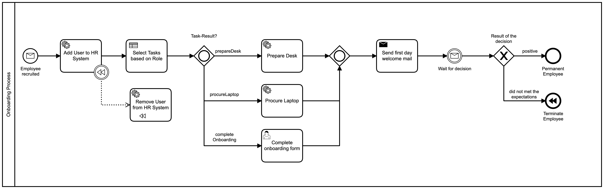
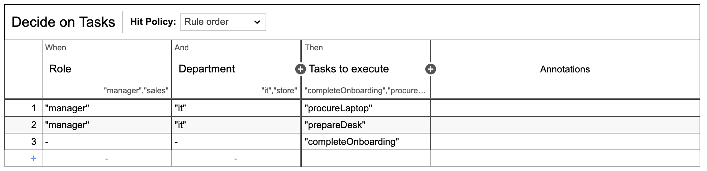

# Camunda-Onboarding-Process
### About this Repository
This repository keeps all the source code for an HR onboarding example done with Camunda. 
The example is structured into various projects.
- Camunda Onboarding: Main project containing all Camunda dependencies and corresponding implementations.
- Service-Now Connector: Acts as an external task service which triggers Service-Now.  
- RPA Bridge: Can also be seen as an external task service which is used for the communication to UIPath in order to orchestrate RPA bots.  

There will be a more detailed readme in each of those projects. In case you want to find more about how to setup the environment
please have a look inside the main project camunda.onboarding. 

### About the Process
The onboarding process using the following example: 

- The process starts of with a message received from the Kafka message broker 
- Afterwards the employee is added into an HR database (PostgreSQL)
- Dependent on his role a decision is made which tasks are required for onboarding the employee. You can see the DMN table for this decision in the picture below.
- Based on the result the desk will be prepared by a UIPath robot, the laptop will be procured by a Service-Now integration and the onboarding form will be completed by a user. 
- Afterwards a mail will be sent out to the new employee.
- Depending on the result of the decision the process is waiting for the employee with either be engaged permanently or will be terminated. In case he is terminated we will compensate and remove the user from the HR system.

### About the Decision  

This picture visualizes the DMN for deciding which task to execute. Depending on the role and the department this decision will be made. Only when the employee is in the role of a manager at the IT department a laptop will be procured and his desk will be prepared. Under any circumstances the onboarding form needs to be completed. 