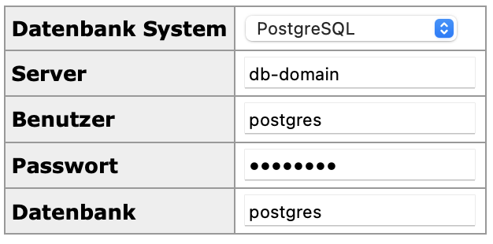

# Camunda Onboarding Process
This is the main project containing all Camunda dependencies and corresponding implementations for the employee onboarding process. 

## How to setup the environment
1. Stop the whole environment (if ever started before) with:
  

    docker container stop $(docker ps -a -q) && docker rm $(docker ps -a -q) && docker volume prune -f
    

2. Build the project

    
    mvn clean install -DskipTests

3. You can now either **run the project directly** as shown below:

Start the local environment with Docker:
    
    
    docker-compose -f docker-env/postgres.yml -f docker-env/kafka.yml up -d

    
Run the application from within your IDE or from the console with:

    mvn clean spring-boot:run -DskipTests

Access cockpit with `http://localhost:8080`

4. Or you can **run a complete dockerized version including Optimize**

Build the application:

    mvn clean install -Poptimize-demo -DskipTests

Start the docker containers:

    docker-compose -f docker-env/postgres.yml -f docker-env/kafka.yml -f docker-env/docker-compose.yml up --build -d

## How to access the database

* you can access the Adminer web application with `http://localhost:8088/`
* the hosts used are named `db-domain` and `db-camunda`
* use `postgres/postgres` and database `postgres`

  

## How to interact with the process in Camunda

1. Produce an EmployeeRecruited Topic Item using the REST Endpoint `http://localhost:38082/topics/employeeRecruitment`
 

     {
    "records": [
        {
            "key": "empl-001",
            "value": {
                "startDate": "2020-12-21",
                "employeeNumber": "employee-3",
                "name": "Paul",
                "lastName": "Miller",
                "shoeSize": "8.5",
                "tShirtSize": "L",
                "role": "Manager",
                "department": "IT",
                "email": "paul.miller@demo.com"
                }
            }
        ]
    }

2. Produce an EmploymentDecision Topic Item using the REST Endpoint `http://localhost:38082/topics/employmentDecision`
   

     {
    "records": [
        {
            "key": "empl-001",
            "value": {
                "employeeNumber": "employee-3",
                "permanentlyEmployed": true
                }
            }
        ]
    }
 