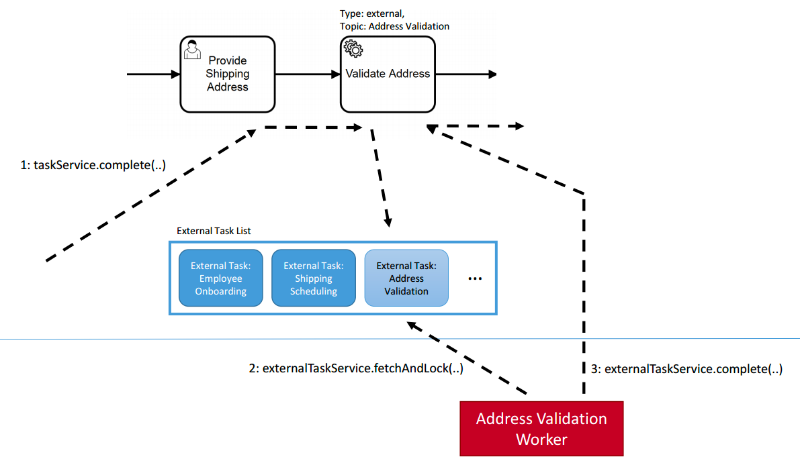

# Service-Now Connector 
In order to trigger a process in Service-Now this connector was implemented. 
Whenever we need to procure a new laptop within our process this connector is used. 

Project contains the JavaScript implementation of the external task pattern which is visualized below:

The worker connects to Camunda's REST API and fetches a task. While performing this operation the corresponding task will be looked. 
After having done so the connector will trigger the Service-Now in order to start the process. 

In the end the external task service will complete the fetched task using Camunda's REST API once again. 
Such patterns are especially recommended in case you plan to trigger some longer lasting tasks. 